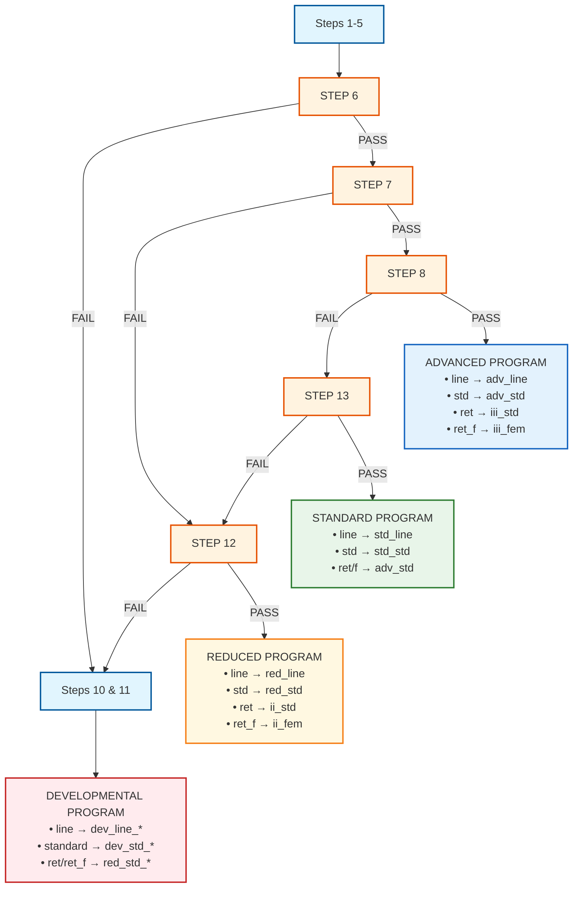

```mermaid
flowchart TD
    START["Steps 1-5"] --> STEP6["STEP 6"]
    
    STEP6 -->|FAIL| STEP10_11["Steps 10 & 11"]
    STEP6 -->|PASS| STEP7["STEP 7"]
    
    STEP10_11 --> DEV["DEVELOPMENTAL PROGRAM<br/>• line → dev_line_*<br/>• standard → dev_std_*<br/>• ret/ret_f → red_std_*"]
    
    STEP7 -->|FAIL| STEP12["STEP 12"]
    STEP7 -->|PASS| STEP8["STEP 8"]
    
    STEP12 -->|FAIL| STEP10_11
    STEP12 -->|PASS| REDUCED["REDUCED PROGRAM<br/>• line → red_line<br/>• std → red_std<br/>• ret → ii_std<br/>• ret_f → ii_fem"]
    
    STEP8 -->|FAIL| STEP13["STEP 13"]
    STEP8 -->|PASS| ADVANCED["ADVANCED PROGRAM<br/>• line → adv_line<br/>• std → adv_std<br/>• ret → iii_std<br/>• ret_f → iii_fem"]
    
    STEP13 -->|FAIL| STEP12
    STEP13 -->|PASS| STANDARD["STANDARD PROGRAM<br/>• line → std_line<br/>• std → std_std<br/>• ret/f → adv_std"]
    
    %% Styling
    classDef stepNode fill:#e1f5fe,stroke:#01579b,stroke-width:2px
    classDef gateNode fill:#fff3e0,stroke:#e65100,stroke-width:2px
    classDef devProgram fill:#ffebee,stroke:#c62828,stroke-width:2px
    classDef reducedProgram fill:#fff8e1,stroke:#f57f17,stroke-width:2px
    classDef standardProgram fill:#e8f5e9,stroke:#2e7d32,stroke-width:2px
    classDef advancedProgram fill:#e3f2fd,stroke:#1565c0,stroke-width:2px
    
    class START,STEP10_11 stepNode
    class STEP6,STEP7,STEP8,STEP12,STEP13 gateNode
    class DEV devProgram
    class REDUCED reducedProgram
    class STANDARD standardProgram
    class ADVANCED advancedProgram
```